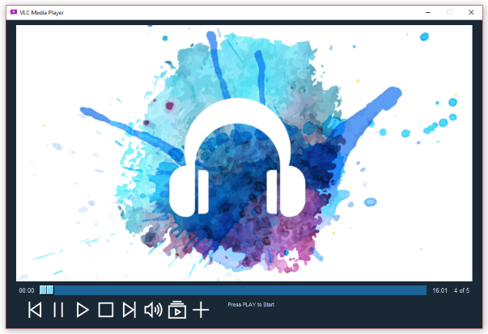
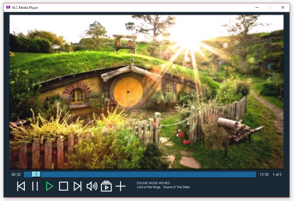
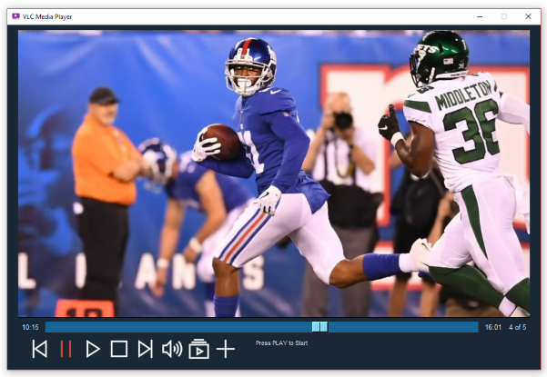
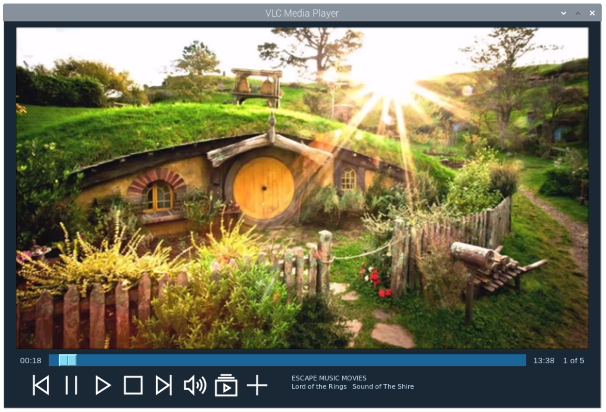

# VLC Media Player  
A media player built with **VLC** & **PySimpleGUI** that will play local and online streaming media. This project is primarily **educational**, so feel free to take and expand it into something much more dynamic and useful. I've also included some very **basic playlist functionality** for convenience.  

##### Other Resources:  
- I've created a [quick-start tutorial](Python-VLC-Quick-Start.ipynb) on how to use the Python-VLC library that covers all of the basic classes and methods used to build this application as well as some others that I haven't included.  

- [Here's a demonstration](https://github.com/oaubert/python-vlc/blob/master/examples/tkvlc.py) that I found online using tkinter; it's a not pretty, but the code was very insightful and much more robust than what you'll find here.  


### Getting start with Linux:  
Before running this application on Linux, please make sure you install the following libraries and applications.
```
sudo pip3 install python-vlc
sudo pip3 install youtube-dl
sudo pip3 install pysimplegui
sudo pip3 install pafy
sudo apt-get install vlc
```

### Getting start with Windows:
Before running this application on Windows, please make sure you install the following libraries and applications. Additionally, On Windows, you also need to download the VLC version that cooresponds to [32 or 64 bit Windows](https://www.videolan.org/vlc/)   

```
pip install python-vlc
pip install pafy
pip install youtube-dl
pip install pysimplegui
```

### Playlist  
I've added some functionality that will allow you to load a playlist via a `playlist.txt` file that must be included in the same directory as the media player script. As you can see from the example image, you can include both local files and url links to streaming media. Spaces between lines do not affect the program, but I didn't take the time to allow for comments, or saving of a new playlist within the application itself. Feel free to add that.

If you've loaded a playlist, any additional media that you load will be appended to the `media_list` object and will be available to play in the current session, but it does not add the track to the `playlist.txt` file. However, that would be a fairly simple add if someone wanted to do it.


### Running on **Windows**    
Startup screen  

  

Playing media - GREEN indicates item is playing  



Paused media - RED is paused  

  

### Running on **Linux (Raspberry Pi // Rasbian Buster**  




